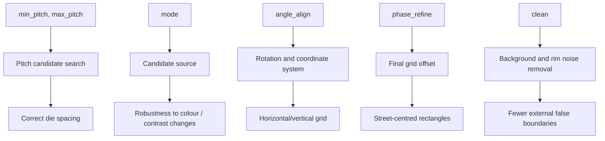
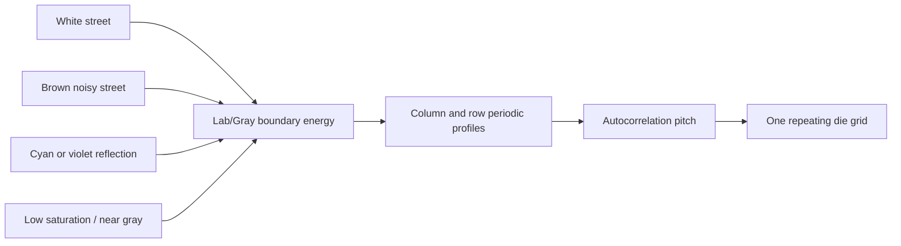
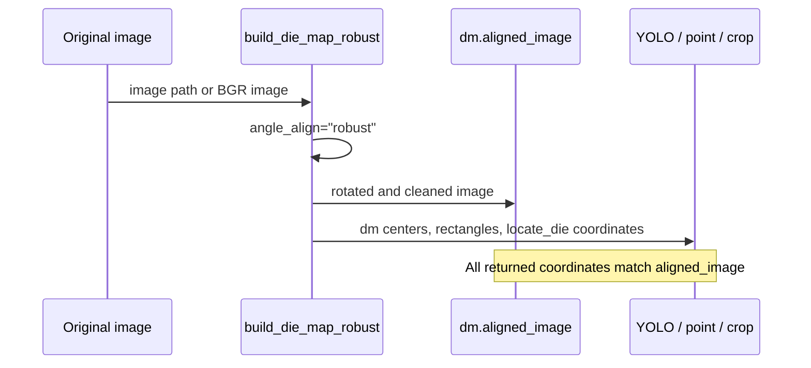
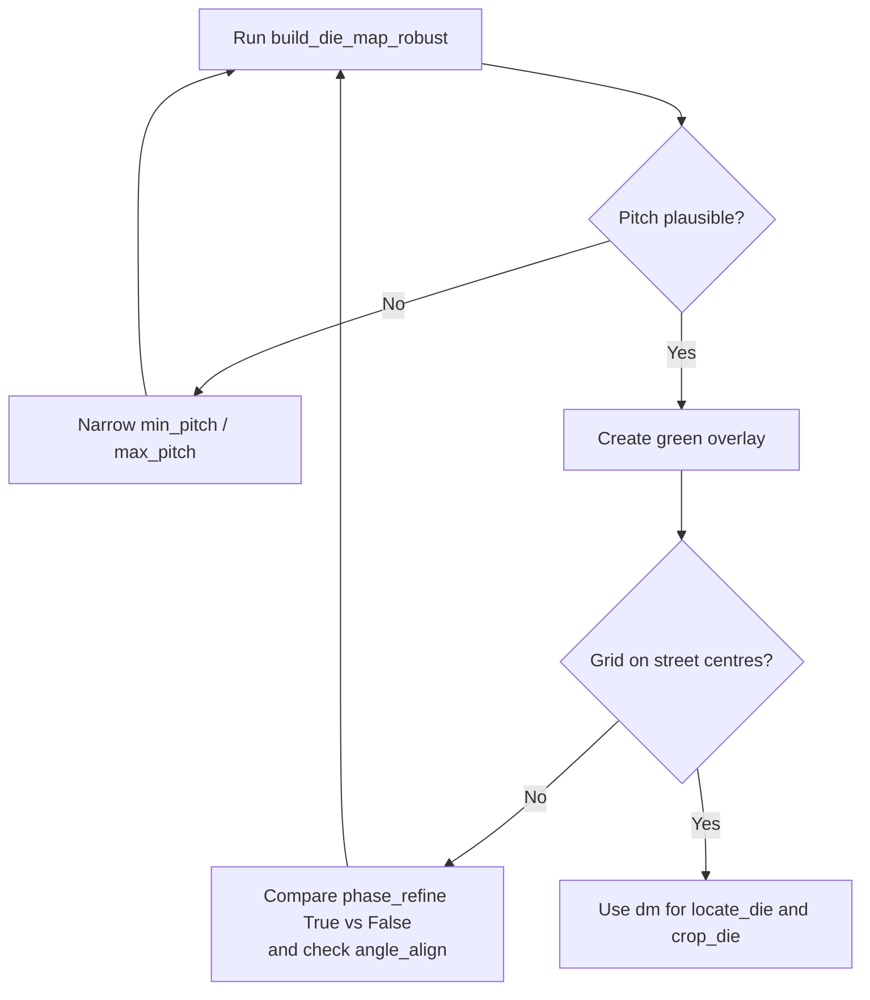

# 색상 강인 Die Map: 동작 원리와 권장 설정

이 문서는 `wafer_die_map_color_robust.py`의
`build_die_map_robust()` 경로를 설명합니다. `wafer_color_v6_claude.py`는 다른
기여자의 독립 구현이며, 이 문서의 API/파라미터와 혼용하지 마십시오.

## 가장 먼저 쓸 값

Die pitch가 약 **84 px**인 촬영 조건의 권장 시작 설정입니다.

```python
from wafer_die_map_color_robust import ColorRobustConfig, build_die_map_robust

cfg = ColorRobustConfig(
    mode="auto",
    min_pitch=75,
    max_pitch=95,
    angle_align="robust",
    phase_refine=True,
    clean=True,
)

dm, info = build_die_map_robust(
    r"E:\data\wafer.png",
    config=cfg,
    return_info=True,
)
```



```mermaid
flowchart LR
    A[Input wafer image] --> B[clean=True<br/>remove outside-wafer noise]
    B --> C{angle_align}
    C -->|robust| D[Projection + FFT<br/>estimate grid tilt]
    C -->|none| E[Keep original coordinates]
    D --> F[aligned_image]
    E --> F
    F --> G[Lab L/a/b + Gray<br/>boundary energy]
    G --> H{mode}
    H -->|auto| I[Compare gradient and std candidates]
    H -->|gradient| J[Colour-invariant edge candidate]
    H -->|std| K[Structure/std candidate]
    I --> L[Best periodicity score]
    J --> L
    K --> L
    L --> M[min_pitch / max_pitch<br/>allowed die-period window]
    M --> N[Pitch X/Y + grid phase]
    N --> O{phase_refine}
    O -->|True| P[Shared small shift<br/>align grid to all streets]
    O -->|False| Q[Use initial phase]
    P --> R[WaferDieMap]
    Q --> R
    R --> S[locate_die / crop_die / dies]
```

## 파라미터가 영향을 주는 위치



| Parameter | Ideal starting value | What it controls | Change it when |
| --- | --- | --- | --- |
| `min_pitch`, `max_pitch` | `75`, `95` for 84 px die | Valid die spacing window | The actual pitch or camera magnification changes. This is the most important manual setting. |
| `mode` | `"auto"` | Chooses gradient vs. structure candidate | Force `"gradient"` for severe white/brown/multicolour street noise; compare `"std"` for stable monochrome imagery. |
| `angle_align` | `"robust"` | Projection+FFT rotation correction | Use `"none"` only when original pixel coordinates must be preserved. |
| `phase_refine` | `True` | Small shared phase shift to centre grid on streets | Temporarily set `False` only to compare an observed constant overlay offset. |
| `clean` | `True` | Removes pixels outside wafer region | Keep enabled unless the wafer silhouette is intentionally nonstandard. |

### Pitch range examples

```mermaid
xychart-beta
    title "Recommended search window by known die pitch"
    x-axis "known pitch (px)" [78, 84, 88, 90, 92]
    y-axis "pixel value" 65 --> 110
    bar "min_pitch" [70, 75, 78, 80, 82]
    bar "max_pitch" [88, 95, 100, 103, 106]
```



## 왜 색상에 덜 민감한가

고정된 HSV 색상이나 밝기 기준으로 street를 선택하지 않습니다. 동일 밝도에서
색만 달라지는 경우도 Lab의 `a/b` 채널 경계가 남고, 색이 사라져 grayscale에
가까워져도 Gray/L 경계와 반복 주기성이 남습니다.



## 정렬과 좌표계: 꼭 확인할 점



`angle_align="robust"`일 때 `dm`의 `center_px`, `rect_px`, `locate_die()` 결과와
crop은 **원본 이미지가 아니라 `dm.aligned_image` 기준**입니다. YOLO 같은 후속
검출도 `dm.aligned_image`에 적용해야 좌표가 맞습니다. 원본 좌표를 유지해야 하면
`angle_align="none"`을 사용합니다.

## 결과를 확인하는 최소 순서



```python
import cv2
from wafer_die_map_color_robust import make_grid_diagnostic

overlay = make_grid_diagnostic(r"E:\data\wafer.png", dm, thickness=1)
cv2.imwrite(r"E:\data\wafer_grid_overlay.png", overlay)
```

## 검증 근거

현재 저장소 테스트 결과는 다음과 같습니다.

| Test group | Tested condition | Result |
| --- | --- | --- |
| Real images | 6 supplied wafer images | All produced die maps; pitch 78/84/88/90/92 px as applicable. |
| Real-image transformations | white+brown noise, chroma-only street, hue/gamma/noise | 84 x 84 px retained. |
| Geometry-preserving fixtures | 7 colour variants including 5-degree rotation | 84 x 84 px retained; rotated fixture corrected by -5.01 degrees. |
| Natural AI colour series | teal, amber, rose reflection palettes | 38 x 28 px, 1,129 dies for every image. |
| Small-angle alignment | two sources x eight injected angles from -3 to +3 degrees | maximum correction error 0.025 degrees; second-pass residual 0.000 degrees. |

Run all relevant checks from the repository root:

```powershell
python test_color_robust.py
python test_adversarial_color_robust.py
python test_color_variants.py
python test_natural_color_series.py
python test_angle_alignment.py
```
